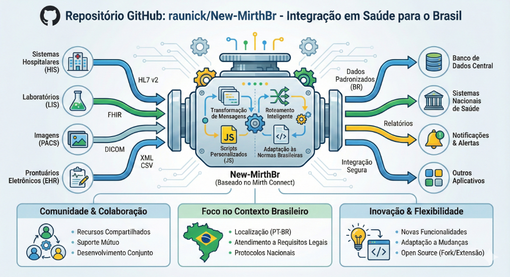

# MirthBR - Healthcare Integration Engine

<p align="center">
  
</p>

<p align="center">
  <strong>High-performance healthcare integration engine built with Rust & React</strong>
</p>

<p align="center">
  <a href="#features">Features</a> •
  <a href="#quick-start">Quick Start</a> •
  <a href="#architecture">Architecture</a> •
  <a href="#api-reference">API</a> •
  <a href="#contributing">Contributing</a>
</p>

---

## Overview

**MirthBR** is a modern, high-performance alternative to Mirth Connect, built from the ground up with **Rust** (backend) and **Next.js/React Flow** (frontend). Designed for healthcare integration workflows, it processes HL7, FHIR, and custom message formats through an intuitive visual flow editor.

<p align="center">
  
</p>

---

## ✨ Features

### Visual Flow Editor
- **13+ Node Types**: Sources, Processors, and Destinations for complete integration flows
- **Inline Editing**: Edit node properties directly on canvas (ports, paths, URLs)
- **Drag & Drop**: Intuitive interface powered by React Flow
- **Real-time Logs**: Monitor message processing and errors in the integrated log viewer
- **Test Node**: Built-in testing with HTTP request capabilities and pipeline injection

### Message Processing
- **HL7 v2 Parsing**: Automatic HL7 to JSON conversion
- **Lua Scripting**: Custom transformation logic with full access to `json`, `hl7`, and `log` modules
- **Field Mapping**: Visual field-to-field mapping between formats
- **Content Routing**: Route messages to different destinations based on conditions
- **MLLP Protocol**: Full support for HL7 MLLP framing with state machine-based reassembly

### Reliability & Persistence
- **Disk Persistence**: All messages saved to SQLite *before* processing, ensuring zero data loss
- **Dead Letter Queue (DLQ)**: Failed messages automatically routed to configurable error destination
- **Auto-Recovery**: System automatically recovers and processes pending messages after restarts
- **Automatic Retry**: Failed messages automatically retried with exponential backoff (1min, 2min, 4min...)
- **Message Deduplication**: Identical messages detected and ignored (24-hour TTL, SHA-based hashing)

### Real-time Monitoring
- **WebSocket Metrics**: `/ws/metrics` streams PROCESSING, SENT, ERROR events in real-time
- **Interactive Dashboard**: Metrics panel displays live counters and event feed
- **Per-Channel Stats**: View processed/sent/errors per channel instantly
- **Messages Dashboard**: Visual interface to list, filter, and retry failed messages

### Channel Management
- **Start/Stop Control**: Start and stop channels via API and UI
- **Port Conflict Detection**: Automatic detection with clear error feedback
- **Backend-Only Viewer**: Inspect channels defined via code/static configuration
- **Deploy Node Feedback**: Visual status indicators for deployment state

### Security
- **Lua Sandboxing**: Secure script execution isolated from the operating system
- **Robust Authentication**: Brute-force protection, rate limiting, secure password hashing
- **Secure API**: Strict header validation and restrictive CORS
- **TLS/HTTPS**: Full TLS support for Admin API and TCP/MLLP listeners

### Performance
- **Async Runtime**: Built on Tokio for non-blocking high-throughput I/O
- **Concurrent Channels**: Run multiple integration channels simultaneously
- **Low Latency**: Sub-millisecond message processing
- **Graceful Shutdown**: Messages in-flight are processed before termination

---

## 📦 Available Nodes

### Sources (4)
| Node | Description | Editable Fields |
|------|-------------|-----------------|
| **HTTP Listener** | Receives HTTP/REST requests | Port, Path |
| **TCP Listener** | Accepts pure TCP connections | Port |
| **File Reader** | Monitors files from a directory | Path, Pattern |
| **Database Poller** | Queries database at intervals | Interval, SQL Query |

### Processors (5)
| Node | Description | Editable Fields |
|------|-------------|-----------------|
| **HL7 Parser** | Converts HL7 v2 ↔ JSON/FHIR | Input Format, Output Format |
| **Lua Script** | Custom transformation code | Label, Code (modal) |
| **Field Mapper** | Maps source → destination fields | Mappings List |
| **Message Filter** | Filters by condition | Condition (modal) |
| **Content Router** | Routes to multiple outputs | Routes List |

### Destinations (4)
| Node | Description | Editable Fields |
|------|-------------|-----------------|
| **File Writer** | Writes to filesystem | Directory, Filename Pattern |
| **HTTP Sender** | Sends HTTP requests | URL, Method |
| **Database Writer** | Inserts/Updates database | Table, Mode, Query |
| **TCP Sender** | Sends via TCP socket (MLLP) | Host, Port |

### Utility Nodes
| Node | Description |
|------|-------------|
| **Deploy Node** | Deploys channel to backend with status feedback |
| **Test Node** | Tests deployed channels with HTTP requests or pipeline injection |
| **Text Node** | Documentation and annotations |

---

## 🚀 Quick Start

### Prerequisites
- **Rust** 1.70+ ([Install](https://www.rust-lang.org/tools/install))
- **Node.js** 18+ ([Install](https://nodejs.org/))
- **Docker** (optional, for containerized deployment)

### Option 1: Docker (Recommended)

```bash
# Start all services
docker compose up -d

# View logs
docker compose logs -f

# Stop services
docker compose down
```

Access:
- **Frontend**: [http://localhost:3000](http://localhost:3000)
- **Backend API**: [http://localhost:3001](http://localhost:3001)

### Option 2: Local Development

#### 1. Start Backend

```bash
cd backend
cargo run
```

Backend starts:
- **API Server**: `http://localhost:3001`
- **Hello World Channel**: HTTP Listener on port `1234` (auto-deployed)

#### 2. Start Frontend

```bash
cd frontend
npm install
npm run dev
```

Open [http://localhost:3000](http://localhost:3000) in your browser.

**Default credentials:**
- Username: `admin`
- Password: `admin123`

> ⚠️ **Change credentials in production!**

---

## 📖 Usage Guide

### Creating a Channel

1. **Add Source**: Click a source node in the sidebar (e.g., HTTP Listener)
2. **Configure Inline**: Click fields to edit (e.g., change port to `8080`)
3. **Add Processor**: Add an HL7 Parser or Lua Script to transform data
4. **Add Destination**: Connect to a File Writer or HTTP Sender
5. **Deploy**: Click the **Deploy Channel** button

### Testing with HL7

```bash
curl -X POST http://localhost:8080/api/messages -d 'MSH|^~\&|SENDER|FACILITY|RECEIVER|DEST|202312140800||ADT^A01|12345|P|2.3
PID|||12345||DOE^JOHN||19800101|M'
```

### Managing Messages (Dashboard)

1. **Access Panel**: Click **Messages** in sidebar or go to `/messages`
2. **View**: See all messages with status (PENDING, PROCESSING, SENT, ERROR)
3. **Retry**: Click **Retry** button on failed messages to reprocess

### Lua Script Examples

```lua
-- Access parsed HL7 as JSON
local data = json.decode(msg.content)
log("Patient: " .. data["PID"][5])

-- Modify and return
data["processed"] = true
return json.encode(data)
```

```lua
-- Error handling with log.error() - stops pipeline and returns error to client
if not data["PID"] or not data["PID"][3] then
    log.error("Patient ID (PID-3) is required")
end
```

### Available Lua Modules

| Module | Functions | Description |
|--------|-----------|-------------|
| `json` | `encode(val)`, `decode(str)` | JSON serialization |
| `hl7` | `parse(str)`, `to_json(str)` | HL7 v2 parsing |
| `log` | `log(msg)`, `log.error(msg)` | System logging (error stops pipeline) |

---

## 🔌 API Reference

| Endpoint | Method | Description |
|----------|--------|-------------|
| `/api/channels` | POST | Deploy a channel configuration |
| `/api/channels` | GET | List active channels |
| `/api/channels/:id/start` | POST | Start a channel |
| `/api/channels/:id/stop` | POST | Stop a channel |
| `/api/logs` | GET | Get recent log entries |
| `/api/health` | GET | Health check |
| `/api/messages` | GET | List messages with filters (status, channel_id) |
| `/api/messages/:id/retry` | POST | Manually retry a failed message |
| `/ws/metrics` | WebSocket | Real-time metrics stream |

### Channel Deploy Payload

```json
{
  "name": "My Channel",
  "enabled": true,
  "source": {
    "type": "http_listener",
    "config": { "port": 8080, "path": "/api/messages" }
  },
  "processors": [
    {
      "id": "proc-1",
      "name": "HL7 Parser",
      "type": "hl7_parser",
      "config": { "inputFormat": "hl7v2", "outputFormat": "json" }
    }
  ],
  "destinations": [
    {
      "id": "dest-1",
      "name": "File Output",
      "type": "file_writer",
      "config": { "path": "./output", "filename": "${timestamp}.json" }
    }
  ]
}
```

---

## 🏗️ Architecture

```
┌─────────────────────────────────────────────────────────────┐
│                     Frontend (Next.js)                       │
│  ┌─────────┐  ┌──────────────┐  ┌───────────────────────┐  │
│  │ Sidebar │  │  FlowCanvas  │  │  Deploy/Test/Metrics  │  │
│  └─────────┘  └──────────────┘  └───────────────────────┘  │
└────────────────────────┬────────────────────────────────────┘
                         │ REST API + WebSocket
                         ▼
┌─────────────────────────────────────────────────────────────┐
│                    Backend (Rust/Axum)                       │
│  ┌───────────────────────────────────────────────────────┐  │
│  │                   ChannelManager                       │  │
│  │  ┌──────────┐  ┌────────────┐  ┌──────────────────┐   │  │
│  │  │ Listener │→ │ Processors │→ │   Destinations   │   │  │
│  │  │(HTTP/TCP)│  │ (HL7, Lua) │  │(File, HTTP, TCP) │   │  │
│  │  └──────────┘  └────────────┘  └──────────────────┘   │  │
│  └───────────────────────────────────────────────────────┘  │
│                              │                               │
│  ┌───────────────────────────┼───────────────────────────┐  │
│  │   SQLite Persistence │ Retry Worker │ Dedup Cache     │  │
│  └───────────────────────────┴───────────────────────────┘  │
│  ┌───────────────────────────────────────────────────────┐  │
│  │              Lua Runtime (mlua) - Sandboxed            │  │
│  │   Modules: json, hl7, log                              │  │
│  └───────────────────────────────────────────────────────┘  │
└─────────────────────────────────────────────────────────────┘
```

---

## 📂 Project Structure

```
mirthbr/
├── backend/                 # Rust Axum Server
│   ├── src/
│   │   ├── api/            # REST API handlers
│   │   ├── engine/         # Channel manager, listeners, processors
│   │   ├── lua_helpers/    # json, hl7, logging modules for Lua
│   │   ├── storage/        # SQLite persistence models
│   │   └── utils/          # Utilities (dedup, retry)
│   └── Cargo.toml
├── frontend/                # Next.js Application
│   ├── src/
│   │   ├── app/            # Pages and global styles
│   │   ├── components/
│   │   │   ├── flow/       # FlowCanvas and 13+ node components
│   │   │   ├── layout/     # Header, Sidebar
│   │   │   └── editor/     # LuaEditorModal, SettingsModal
│   │   ├── stores/         # Zustand state management (slices)
│   │   └── lib/            # API client, flow-compiler
│   └── package.json
├── samples/                 # Sample workflows and HL7 messages
└── README.md
```

---

## 🤝 Contributing

Contributions are welcome! Please open an issue or submit a pull request.

1. Fork the repository
2. Create your feature branch (`git checkout -b feature/AmazingFeature`)
3. Commit your changes (`git commit -m 'Add some AmazingFeature'`)
4. Push to the branch (`git push origin feature/AmazingFeature`)
5. Open a Pull Request

---

## 📄 License

MIT License - see [LICENSE](LICENSE) for details.

---

<p align="center">
  Made with ❤️ for Healthcare Integration
</p>
